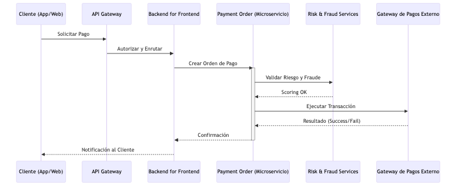

# Propuesta de Arquitectura de Integración: Modernización Bancaria

## Resumen Ejecutivo
Esta propuesta técnica describe la modernización de la infraestructura de integración de una institución financiera tradicional hacia un modelo ágil, escalable y seguro. La solución adopta el estándar internacional BIAN y principios de Event-Driven Architecture para permitir una coexistencia eficiente entre sistemas legados y digitales, garantizando baja latencia y alta disponibilidad.

## Estructura de la documentación
- **Documentos técnicos** (carpeta `docs/`): Estrategia de Integración, Seguridad e IAM, Infraestructura HA/DR, Plan de Migración.
- **Diagramas C4** (carpeta `diagrams/`): Contexto, Contenedores, Componentes de Pago y flujos en formato Mermaid.

---

## 1. Arquitectura de Contexto (C4 Nivel 1)
Interacción del sistema bancario modernizado con los usuarios y sistemas externos.

---

## 2. Arquitectura de Contenedores (C4 Nivel 2)
Detalle de las aplicaciones, servicios y capas de datos, enfatizando la integración multicore.

---

## 4. Flujos de Integración (Diagramas de Secuencia)

### 4.1. Sincronización Multicore (CDC)
Este flujo muestra cómo se mantiene la integridad de datos entre el Core Legado y el ecosistema Digital en tiempo real.

### 4.2. Integración de Pagos y Prevención de Fraude
Flujo detallado de una transacción originada en canales digitales integrando múltiples servicios BIAN.

---

## 5. Mapeo de Servicios a Dominios BIAN
Para asegurar el 100% de alineación con estándares de industria, se presenta el mapeo de los microservicios propuestos a los Service Domains de BIAN.

| Microservicio | Dominio BIAN | Descripción |
| :--- | :--- | :--- |
| Core Digital | Position Keeping | Gestión de saldos y posiciones en tiempo real. |
| Servicio de Pagos | Payment Order | Gestión y ejecución de órdenes de pago multicanal. |
| Gestión de Riesgos | Credit Risk | Evaluación de límites y perfiles de riesgo. |
| Prevención de Fraude | Fraud Check | Análisis de patrones para detección de fraude. |
| Adaptador Legacy | Core Banking Gateway | Abstracción de protocolos legacy (ISO 8583). |

---

## 6. Estrategia de Integración Multicore
La estrategia se basa en el modelo de Parallel Core Banking combinado con el patrón Strangler Fig para asegurar una transición sin riesgos.

### Coexistencia y Sincronización
El Core Legado y el Digital Core operan simultáneamente. Los productos nuevos se gestionan en el Core Digital, mientras que el historial se mantiene en el legado.

- Change Data Capture (CDC): Se utiliza Debezium para capturar cambios en el Core Legado en tiempo real y publicarlos en Kafka.
- Digital Integration Hub (DIH): Una capa de datos de ultra-baja latencia (Redis) consolida información de múltiples cores para consultas de lectura masivas.

### Patrones de Integración
1. Event-Driven Architecture (EDA): Uso de Apache Kafka para desacoplar sistemas y procesar transacciones de forma asíncrona.
2. API-First Approach: Diseño de contratos OpenAPI alineados con el estándar BIAN antes del desarrollo.
3. Capa de Adaptadores: Implementación de servicios especializados para la transformación de protocolos (ISO 8583 a REST/JSON).

---

## 7. Seguridad, IAM y Cumplimiento Normativo
Se implementa una arquitectura Zero Trust para garantizar la integridad y confidencialidad.

### Gestión de Identidad y Acceso (IAM)
- Autenticación: Basada en OpenID Connect (OIDC). Uso de Multi-Factor Authentication (MFA) para canales externos.
- Autorización: Uso de tokens JWT firmados con control de acceso basado en roles (RBAC) y atributos (ABAC).
- Seguridad Interna: mTLS entre microservicios gestionado a través de un Service Mesh (Istio).

### Seguridad de APIs
- Cumplimiento FAPI (Financial-grade API) para APIs expuestas a terceros.
- Rate Limiting, IP Whitelisting y validación estricta de esquemas en el API Gateway.

### Protección de Datos y Privacidad
- Encriptación: Datos sensibles (PII) encriptados en reposo (AES-256) y en tránsito (TLS 1.2+).
- Cumplimiento: Trazabilidad inmutable de accesos para auditorías regulatorias (GDPR/Protección de Datos locales).

---

## 8. Alta Disponibilidad y Recuperación ante Desastres

### Disponibilidad y Resiliencia
- Despliegue Multi-Región: Configuración Active-Active para lecturas y Active-Passive con replicación síncrona para escrituras críticas.
- Infraestructura: Orquestación mediante Kubernetes (AKS/EKS) con políticas de auto-escalado horizontal y recuperación automática.

### Recuperación ante Desastres (DR)
- RTO / RPO: Objetivos mínimos mediante estrategias de replicación continua de datos y automatización de procesos de conmutación por error (failover).

### Observabilidad
- Implementación de OpenTelemetry para rastreo distribuido, logs centralizados y monitoreo proactivo del estado de salud de los servicios.

---

## 9. Arquitectura de Componentes (C4 Nivel 3) - Pago de Servicios
Detalle de la integración interna de los componentes para el flujo de pagos.

---

## 10. Plan de Migración Gradual

La modernización se llevará a cabo en fases iterativas para minimizar el riesgo operativo y financiero.

### Fases de Ejecución
1. Fase de Cimentación: Implementación del ecosistema base (API Gateway, IAM y Observabilidad).
2. Capa de Integración Digital: Activación de CDC y Digital Integration Hub para optimizar lecturas desde el Core Legado.
3. Desacoplamiento de Servicios Periféricos: Migración de funcionalidades no críticas como notificaciones y consultas de saldos.
4. Lanzamiento de Core Paralelo: Los nuevos productos nacen 100% digitales en el nuevo Core.
5. Transición Strangler: Migración por lotes de clientes existentes hacia el nuevo Core hasta el retiro final del sistema legado.

---

*Propuesta técnica de Arquitectura de Integración.*
